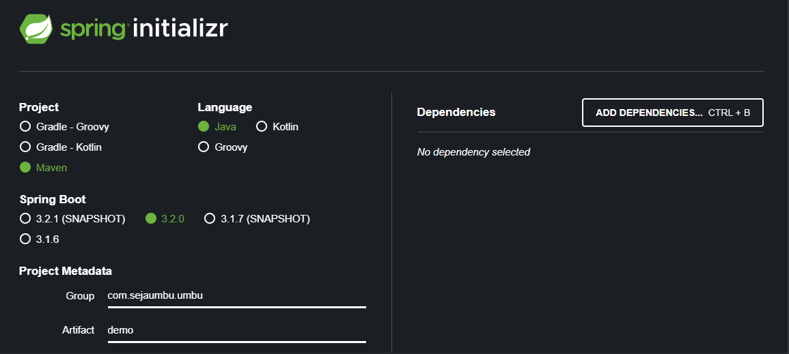
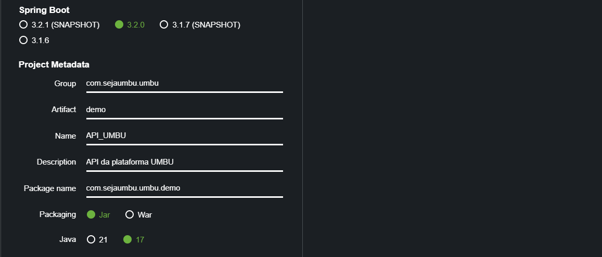
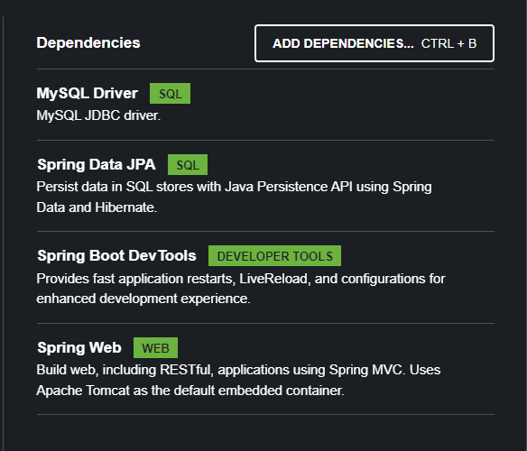

# UMBU BACK END

Bem-vindo ao repositório do backend da UMBU, a plataforma revolucionária que conecta talentosos jardineiros a quem precisa de seus serviços.

Este repositório contém o código-fonte do backend da UMBU, desenvolvido em Java Spring Boot. Aqui, você encontrará detalhes sobre a implementação, a estrutura do projeto e as dependências necessárias para executar com sucesso a plataforma.

### Declarando dependências
 
 

## Estrutura do Projeto:

- Spring Boot Version: 3.2.0
- Linguagem: Java
- Package Name: com.seja.umbu
- Packaging: Jar
- Java Version: 17

A estrutura do projeto segue as convenções do Spring Boot e está organizada de acordo com as melhores práticas para facilitar a manutenção e escalabilidade.

### Dependências utilizadas:



1. **MySQL Driver:**

- Descrição: Essa dependência fornece o driver JDBC (Java Database Connectivity) para o MySQL, permitindo que o Spring Boot se conecte e interaja com um banco de dados MySQL.
- Como se encaixa no projeto: Como a UMBU precisa armazenar informações, como perfis de jardineiros, avaliações e outras, o MySQL Driver é essencial para estabelecer a conexão com o banco de dados MySQL, garantindo que o Spring Boot possa salvar e recuperar dados de maneira eficiente.

2. **Spring Data JPA:**

- Descrição: O Spring Data JPA é uma parte do Spring Data que simplifica o desenvolvimento de camadas de acesso a dados baseadas em JPA (Java Persistence API). Ele oferece uma abordagem mais fácil e eficiente para a interação com bancos de dados relacionais usando objetos Java.
- Como se encaixa no projeto: O Spring Data JPA simplifica a implementação de operações de banco de dados, como consultas, inserções, atualizações e exclusões. Ele integra-se perfeitamente ao Spring Boot, permitindo que você trabalhe com entidades Java que representam tabelas no banco de dados sem a necessidade de escrever consultas SQL manualmente.

3. **Spring Boot DevTools:**

- Descrição: O Spring Boot DevTools é uma ferramenta que visa melhorar a experiência de desenvolvimento ao oferecer recursos como reinicialização automática do aplicativo, entre outros.
- Como se encaixa no projeto: Durante o desenvolvimento, o Spring Boot DevTools é extremamente útil. Ele permite que você faça alterações no código e veja as atualizações refletidas instantaneamente sem precisar reiniciar manualmente o aplicativo. Isso acelera o ciclo de desenvolvimento e facilita a depuração.

4. **Spring Web:**

- Descrição: O módulo Spring Web fornece recursos para o desenvolvimento de aplicativos da web, incluindo a implementação do padrão MVC (Model-View-Controller) e utilitários para facilitar a criação de aplicativos da web.
- Como se encaixa no projeto: Com o Spring Web, você pode construir APIs RESTful e endpoints da web de maneira eficiente. Ele permite que você exponha serviços da UMBU pela web, facilitando a comunicação com clientes, como aplicativos front-end ou outros serviços externos.

- Essas dependências combinadas ajudam a construir uma aplicação robusta, conectada ao banco de dados MySQL, com uma camada de acesso a dados simplificada pelo Spring Data JPA e recursos de desenvolvimento facilitados pelo Spring Boot DevTools e Spring Web. Isso proporciona uma base sólida para o desenvolvimento e expansão da plataforma UMBU.

```java
<?xml version="1.0" encoding="UTF-8"?>
<project xmlns="http://maven.apache.org/POM/4.0.0" xmlns:xsi="http://www.w3.org/2001/XMLSchema-instance"
	xsi:schemaLocation="http://maven.apache.org/POM/4.0.0 https://maven.apache.org/xsd/maven-4.0.0.xsd">
	<modelVersion>4.0.0</modelVersion>
	<parent>
		<groupId>org.springframework.boot</groupId>
		<artifactId>spring-boot-starter-parent</artifactId>
		<version>3.2.0</version>
		<relativePath/> <!-- lookup parent from repository -->
	</parent>
	<groupId>com.umbu.api</groupId>
	<artifactId>apiumbu</artifactId>
	<version>0.0.1-SNAPSHOT</version>
	<name>apiumbu</name>
	<description>API UMBU</description>
	<properties>
		<java.version>17</java.version>
	</properties>
	<dependencies>
		<dependency>
			<groupId>org.springframework.boot</groupId>
			<artifactId>spring-boot-starter-data-jpa</artifactId>
		</dependency>
		<dependency>
			<groupId>org.springframework.boot</groupId>
			<artifactId>spring-boot-starter-web</artifactId>
		</dependency>

		<dependency>
			<groupId>org.springframework.boot</groupId>
			<artifactId>spring-boot-devtools</artifactId>
			<scope>runtime</scope>
			<optional>true</optional>
		</dependency>
		<dependency>
			<groupId>com.mysql</groupId>
			<artifactId>mysql-connector-j</artifactId>
			<scope>runtime</scope>
		</dependency>
		<dependency>
			<groupId>org.springframework.boot</groupId>
			<artifactId>spring-boot-starter-test</artifactId>
			<scope>test</scope>
		</dependency>
	</dependencies>

	<build>
		<plugins>
			<plugin>
				<groupId>org.springframework.boot</groupId>
				<artifactId>spring-boot-maven-plugin</artifactId>
			</plugin>
		</plugins>
	</build>

</project>
```
### Como conectar com o Banco de Dados

```
## Configura URL do banco
## É importante que o MySQL esteja preparado com o banco antes de executar esse programa
spring.datasource.url=jdbc:mysql://localhost:3307/umbu_database // URL de acesso da umbu_database
## Usuário de acesso
spring.datasource.username= //seu_usuario_do_banco
## Senha do banco
spring.datasource.password= //sua_senha_do_banco
## Configura atualizações do banco -> Caso esteja como valor "update" a sua aplicação poderá fazer alterações nas tabelas no banco de acordo com o "convencional". Para não permitir isso você pode usar o valor "none".
spring.jpa.hibernate.ddl-auto=update
##Configuração que mostra que o SQL que foi executado
spring.jpa.properties.hibernate.show_sql=true
```

### 1. Models (models):

Propósito: Contém as classes que representam as entidades de dados da aplicação, neste caso, a classe Usuario. Os modelos mapeiam diretamente para as tabelas do banco de dados e definem os atributos e comportamentos das entidades.

```
package com.sejaumbu.umbu.models;

import jakarta.persistence.*;

import javax.xml.validation.Schema;
import java.util.Date;
@Entity
@Table(schema = "usuario")
public class Usuario {
    @Id
    @GeneratedValue(strategy = GenerationType.IDENTITY)
    private Integer idusuario;
    public String nome;
    private Integer endereco;
    private String telefone;
    private String email;
    @Column(name = "data_nascimento")
    private Date dataNascimento;
    private String cpf;
    @Column(name = "data_registro")
    private Date dataRegistro;
    private String historico;
    private String preferencias;
    private String senha;

    public Integer getIdusuario() {
        return idusuario;
    }

    public void setIdusuario(Integer idusuario) {
        this.idusuario = idusuario;
    }

    public String getNome() {
        return nome;
    }

    public void setNome(String nome) {
        this.nome = nome;
    }

    public Integer getEndereco() {
        return endereco;
    }

    public void setEndereco(Integer endereco) {
        this.endereco = endereco;
    }

    public String getTelefone() {
        return telefone;
    }

    public void setTelefone(String telefone) {
        this.telefone = telefone;
    }

    public String getEmail() {
        return email;
    }

    public void setEmail(String email) {
        this.email = email;
    }

    public Date getDataNascimento() {
        return dataNascimento;
    }

    public void setDataNascimento(Date dataNascimento) {
        this.dataNascimento = dataNascimento;
    }

    public String getCpf() {
        return cpf;
    }

    public void setCpf(String cpf) {
        this.cpf = cpf;
    }

    public Date getDataRegistro() {
        return dataRegistro;
    }

    public void setDataRegistro(Date dataRegistro) {
        this.dataRegistro = dataRegistro;
    }

    public String getHistorico() {
        return historico;
    }

    public void setHistorico(String historico) {
        this.historico = historico;
    }

    public String getPreferencias() {
        return preferencias;
    }

    public void setPreferencias(String preferencias) {
        this.preferencias = preferencias;
    }

    public String getSenha() {
        return senha;
    }

    public void setSenha(String senha) {
        this.senha = senha;
    }

}

```

### 2. Repository (repository):

Propósito: Contém interfaces que estendem JpaRepository (fornecido pelo Spring Data JPA). Essas interfaces oferecem métodos abstratos para interagir com o banco de dados de forma simplificada. No caso, UsuarioRepository fornece operações de banco de dados específicas para a entidade Usuario, como busca, salvamento e exclusão.

```
package com.sejaumbu.umbu.repository;

import com.sejaumbu.umbu.models.Usuario;
import org.springframework.data.jpa.repository.JpaRepository;
import org.springframework.stereotype.Repository;

import java.util.UUID;

@Repository
public interface UsuarioRepository extends JpaRepository<Usuario, UUID> {
}

```
### 3. Service (service):

Propósito: Contém a lógica de negócios da aplicação relacionada à entidade Usuario. O serviço UsuarioServico é responsável por realizar operações mais complexas, validar dados e interagir com o repositório para acessar ou modificar dados no banco. Também utiliza a classe RespostaModelo para estruturar respostas consistentes.

```
package com.sejaumbu.umbu.service;

import com.sejaumbu.umbu.controller.RespostaModelo;
import com.sejaumbu.umbu.models.Usuario;
import com.sejaumbu.umbu.repository.UsuarioRepository;
import org.springframework.beans.factory.annotation.Autowired;
import org.springframework.http.HttpStatus;
import org.springframework.http.ResponseEntity;
import org.springframework.stereotype.Service;

@Service
public class UsuarioServico {
    @Autowired
    private UsuarioRepository ur;

    @Autowired
    private RespostaModelo rm;
    public Iterable<Usuario> listar() {
        return ur.findAll();
    }

    public ResponseEntity<?> cadastrarAlterar(Usuario um, String acao) {
        if(um.getEmail().equals("")){
            rm.setMensagem("O email do usuario é obrigatório");
            return new ResponseEntity<RespostaModelo>(rm, HttpStatus.BAD_REQUEST);
        } else if (um.getSenha().equals("")) {
            rm.setMensagem("A senha do usuário é obrigatória");
            return new ResponseEntity<RespostaModelo>(rm, HttpStatus.BAD_REQUEST);
        } else {
            if(acao.equals("cadastrar")) {
                return new ResponseEntity<Usuario>(ur.save(um), HttpStatus.CREATED);
            } else {
                return new ResponseEntity<Usuario>(ur.save(um), HttpStatus.OK);
            }
        }
    }
}

```
### 4. Controller (controller):

Propósito: Define os endpoints da API REST que podem ser acessados pelos clientes. O UsuarioController recebe requisições HTTP e aciona os métodos do serviço correspondente (UsuarioServico). Ele mapeia os endpoints como /usuario/listar, /usuario/cadastrar, e /usuario/alterar para operações específicas relacionadas a usuários.

```

package com.sejaumbu.umbu.controller;

import com.sejaumbu.umbu.models.Usuario;
import com.sejaumbu.umbu.repository.UsuarioRepository;
import com.sejaumbu.umbu.service.UsuarioServico;
import org.springframework.beans.factory.annotation.Autowired;
import org.springframework.http.ResponseEntity;
import org.springframework.web.bind.annotation.*;


@RestController
@CrossOrigin(origins = "*")
@RequestMapping("/usuario")
public class UsuarioController {

    @Autowired
    UsuarioRepository dbConnection;

    @Autowired
    private UsuarioServico us;

    @GetMapping("/listar")
    public Iterable<Usuario> listar() {
        return us.listar();
    }

    @PostMapping("/cadastrar")
    public ResponseEntity<?> cadastrar(@RequestBody Usuario novoUsuario) {
        return us.cadastrarAlterar(novoUsuario, "cadastrar");
    }

    @PutMapping("/alterar")
    public ResponseEntity<?> alterar(@RequestBody Usuario novoUsuario) {
        return us.cadastrarAlterar(novoUsuario, "alterar");
    }

    @CrossOrigin
    @GetMapping("/")
    public Iterable<Usuario> findAllRecords() {
        return dbConnection.findAll();
    }
}

```
#### Resumo Funcional:

- Modelos (models): Representação de entidades de dados.
- Repositórios (repository): Camada de acesso ao banco de dados, fornece métodos para manipular dados.
- Serviços (service): Lógica de negócios, coordena interações entre controladores e repositórios.
- Controladores (controller): Define endpoints da API, recebe requisições HTTP e aciona serviços.
  
Essa estrutura facilita a separação de responsabilidades, tornando o código mais modular, fácil de entender e manter. Cada componente desempenha um papel específico na aplicação, contribuindo para uma arquitetura organizada e escalável.

### Requisições:

As requisições GET, POST e PUT são métodos HTTP (Hypertext Transfer Protocol) usados para realizar diferentes tipos de operações em um servidor. Cada um desses métodos tem um propósito específico, e sua escolha depende do tipo de interação desejada com o recurso no servidor.

1. GET (Obter):

Propósito: Solicita a recuperação de dados de um recurso específico no servidor.
Características Principais:
Não tem um corpo de mensagem no pedido.
Os parâmetros são geralmente anexados à URL (por exemplo, em consultas).
É uma operação "segura", o que significa que não deve alterar o estado do servidor.

Exemplo:

```GET
localhost:8080/usuario/
```

2. POST (Enviar):

Propósito: Submete dados para serem processados a um recurso especificado.
Características Principais:
Pode incluir um corpo de mensagem contendo dados a serem processados.
É usado para criar um novo recurso no servidor ou realizar uma operação que pode causar uma mudança de estado no servidor.
Não é considerado seguro, pois pode alterar o estado do servidor.

Exemplo:

```POST
localhost:8080/usuario/cadastrar
```

3. PUT (Atualizar):

Propósito: Substitui todas as representações atuais do recurso de destino pelos dados enviados na solicitação.
Características Principais:
Geralmente usado para atualizar um recurso existente no servidor.
O corpo da mensagem contém os dados atualizados do recurso.
Se o recurso não existir, pode criar um novo recurso com os dados fornecidos.
Pode ser usado para criar ou atualizar um recurso.

Exemplo:

```PUT
localhost:8080/usuario/alterar
```

Existem outros métodos HTTP, como DELETE, PATCH, OPTIONS, entre outros, cada um com seu propósito específico.
O uso correto dos métodos HTTP é fundamental para seguir os princípios e as melhores práticas da arquitetura RESTful (Representational State Transfer).

Vamos falar sobre as principais requisições do projeto, com foco nos endpoints definidos no UsuarioController, explicando a finalidade de cada um:

Requisições no UsuarioController

1. **Listar Usuários (GET /usuario/listar) ou (GET /usuario/):**

Descrição: Endpoint para recuperar a lista de todos os usuários cadastrados.
Propósito: Fornecer uma visão geral de todos os usuários registrados na plataforma.

2. **Cadastrar Usuário (POST /usuario/cadastrar):**

Descrição: Endpoint para cadastrar um novo usuário na plataforma.
Propósito: Permitir que novos usuários se registrem na UMBU, fornecendo informações como nome, email, telefone, etc.

3. **Alterar Usuário (PUT /usuario/alterar):**

Descrição: Endpoint para alterar as informações de um usuário existente.
Propósito: Possibilitar a atualização de dados de um usuário, como mudança de senha, atualização de preferências, etc.

